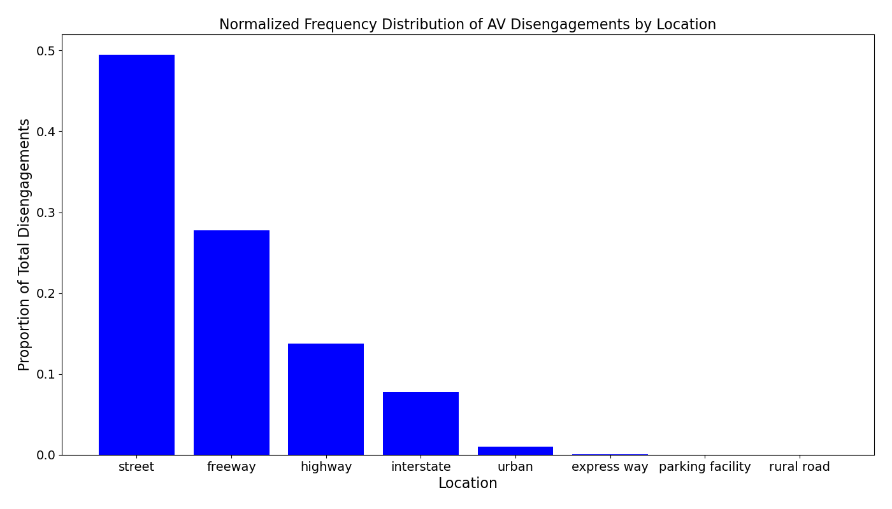
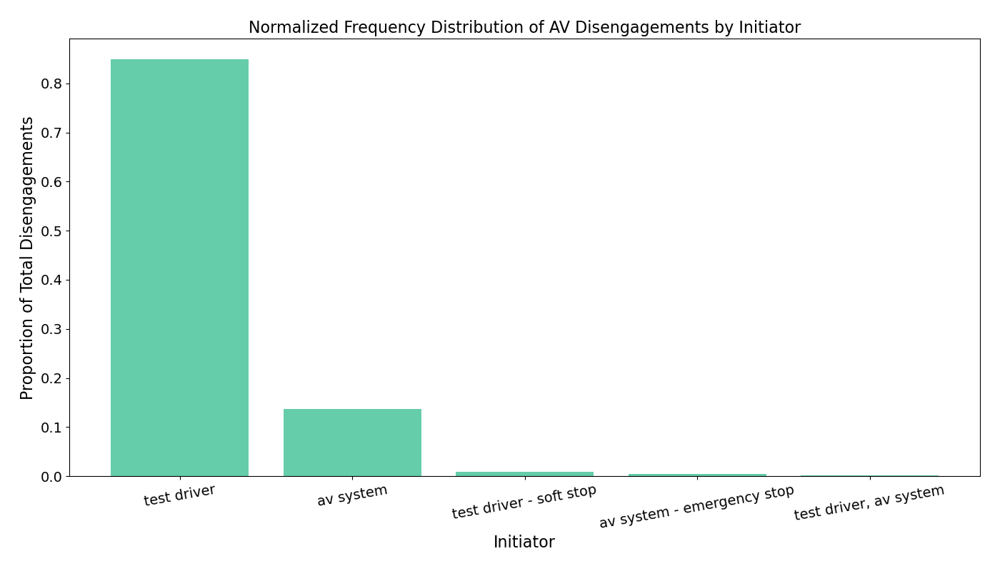
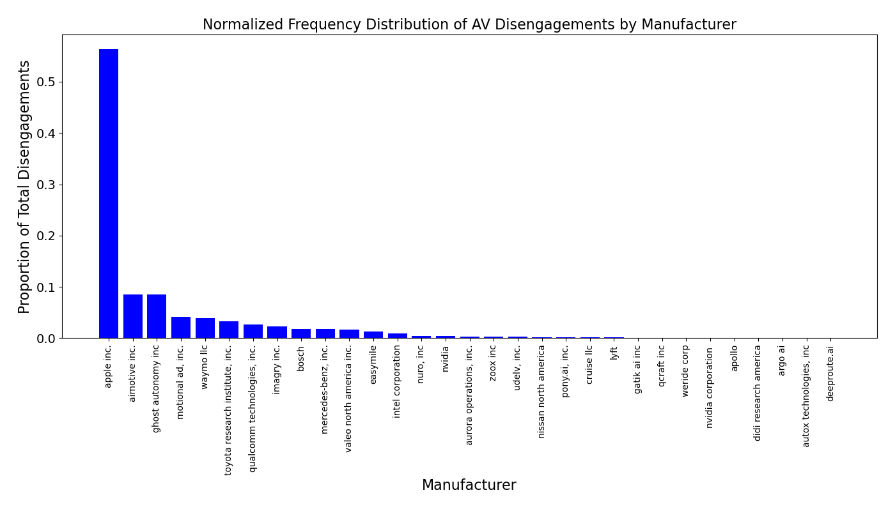
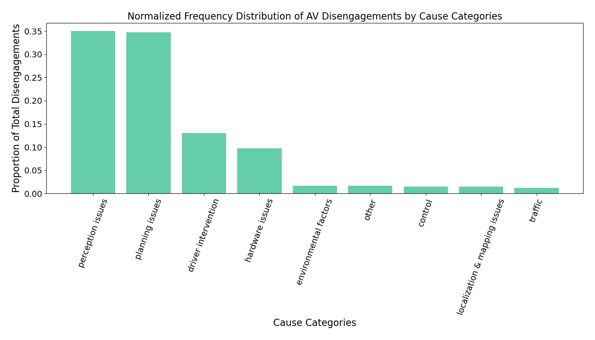
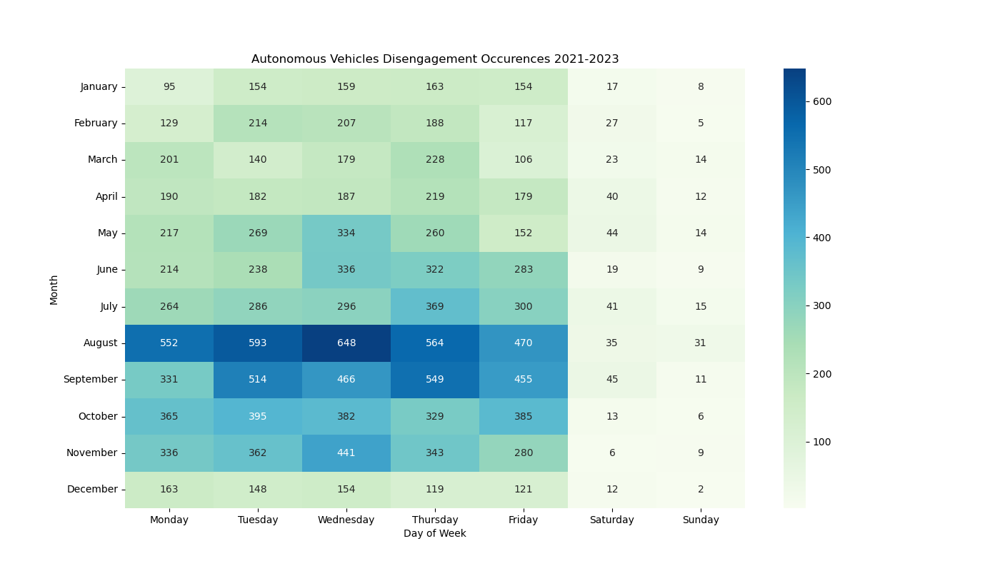
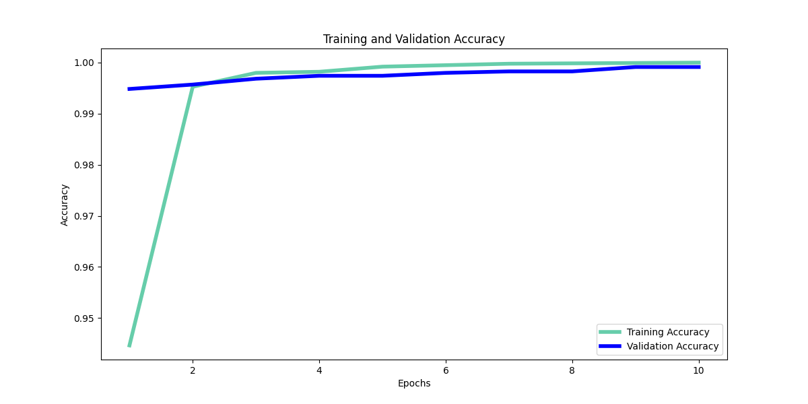
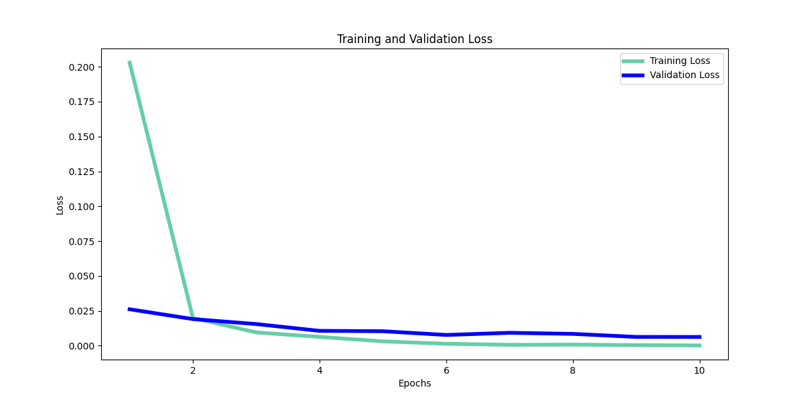

# Navigating Challenges: Leveraging DistilBERT for Autonomous Vehicles Disengagement Insights

## Table of Contents
1. [Executive Summary](#Executive-Summary)
2. [Problem Statement](#Problem-Statement)
3. [Data Collection and Preparation](#Data-Collection-and-Preparation)
4. [Data Dictionary](#Data-Dictionary)
5. [Exploratory Data Analysis (EDA) and Visualization](#Exploratory-Data-Analysis-(EDA)-and-Visualization)
6. [Model Development and Evaluation](#Model-Development-and-Evaluation)
7. [Conclusions](#Conclusions)
8. [Recommendations](#Recommendations)
9. [Sources](#Sources)
10. [How to Use](#How-to-Use)
11. [Technologies and Libraries](#Technologies-and-Libraries)

## Executive Summary
The objective of this project was to develop a robust multiclass text classification model to categorize autonomous vehicle (AV) disengagement reports. These reports were divided into categories such as environmental factors, perception issues, planning issues, hardware issues, localization & mapping issues, driver intervention, and others. By accurately classifying these reports, we aim to better understand the causes of disengagements and devise strategies to mitigate them, ultimately enhancing the performance and safety of autonomous vehicles.

To achieve this, we employed the DistilBERT model, a distilled version of BERT (Bidirectional Encoder Representations from Transformers). The project involved preprocessing the dataset by tokenizing the text using DistilBERT's tokenizer and encoding the labels with LabelEncoder. We then developed a custom neural network model by adding dropout and dense layers on top of DistilBERT. The model was trained using PyTorch with an Adam optimizer and a learning rate scheduler. During training, we tracked and plotted the training and validation loss and accuracy over several epochs to monitor the model's performance.

The results demonstrated that the DistilBERT-based model achieved satisfactory accuracy in classifying the disengagement reports. The visualizations of training and validation metrics provided insights into the model's learning behavior, highlighting areas of potential overfitting or underfitting. The final evaluation on the validation set showed good precision, recall, and F1-score across most categories, proving the model's effectiveness in identifying critical issues that lead to autonomous vehicle disengagements.

**Key Takeaways:**
- Disengagements occur most frequently when AV is in the street, initiated by the test driver, and owned by Apple Inc.
- Disengagements are more frequent on weekdays and during the summer months, especially in August on Wednesdays.
- The DistilBERT model effectively categorizes disengagement reasons with 99% accuracy when evaluated using the validation dataset.The model shows good precision, recall, and F1-score for all disengagement categories.
- Future work suggestions:
- using more diverse datasets, fine-tuning hyperparameters, exploring different architectures for higher accuracy, and integrating the model into a real-time monitoring system for continuous evaluation and improvement.

## Problem Statement
Autonomous vehicles are increasingly becoming a part of modern transportation systems, promising safer and more efficient travel. The AV market size is USD 119.14 billion in 2023 and is projected to reach USD 1,075.95 billion by 2032.
 However, these vehicles still face challenges in maintaining full autonomy, often requiring disengagements where human drivers must take over. These disengagements can arise from various factors such as environmental conditions, perception errors, planning issues, hardware failures, localization and mapping inaccuracies, and driver interventions. Understanding and categorizing these disengagements is crucial for improving the reliability and safety of autonomous vehicles.

#### Project Goals
1. Analyze California disengagements reports to identify the most common characteristics of AV disengagements (i.e. location, initiator, etc.).
2. Develop a Multi-class Text Classification Model to categorize autonomous vehicle disengagement descriptions into predefined categories. Understanding common disengagement root causes from real world data is crucial for improving the safety and reliability of autonomous vehicles.
3. Evaluate the model and fine-tune the model to achieve at least an 80% accuracy score on the validation dataset. This model serves as a proof of concept that is scalable for future use.

## Data Collection and Preparation
- Data Collection: Collect disengagement reports from autonomous vehicles manufacturers on the California DMV website for 2021, 2022, and 2023 [1]. 
- Initial Data Review: Inspect the dataset for completeness and identify any missing or corrupted data entries.
- Data Preprocessing: Use DistilBERT's tokenizer to convert textual reports into tokenized sequences.
- Data Label Encoding: Encode the categorical labels of disengagement reasons using LabelEncoder to convert them into numerical format for model training.
- Data Splitting: Split the dataset into training (80%) and validation (20%) sets to ensure the model can generalize to unseen data. The full dataset for the modeling step contains 17454 rows of data. The train dataset contains 13963 rows and the test dataset contains 3491. All three sets include 3 columns (description, disengagement_category, and encoded_category). 
- Dataset Creation: Create PyTorch datasets (Triage class) for both training and validation data, incorporating tokenized sequences and encoded labels. DataLoaders is used to handle batching and shuffling for training and validation processes.
- Exploratory Data Analysis (EDA): Analyze the distribution of disengagement by locations, initiators, AV Manufacturers, disengagement occurences, most frequent words and token lengths in disengagement descriptions.

## Data Dictionary

| Feature                        | Type     | Source             | Description                                                                                                     |
|--------------------------------|----------|--------------------|-----------------------------------------------------------------------------------------------------------------|
| **manufacturer**               | string   | California DMV     | The name of the company that manufactured the autonomous vehicle.                                               |
| **permit_number**              | integer  | California DMV     | The permit number assigned to the autonomous vehicle by the California DMV.                                     |
| **date**                       | string   | California DMV     | The date on which the disengagement report was filed.                                                           |
| **vin**                        | string   | California DMV     | The Vehicle Identification Number of the autonomous vehicle.                                                    |
| **capable_without_driver**     | boolean  | California DMV     | Indicates whether the vehicle is capable of operating without a driver present (True or False).                 |
| **driver_present**             | boolean  | California DMV     | Indicates whether a driver was present in the vehicle at the time of disengagement (True or False).             |
| **disengagement_initiated_by** | string   | California DMV     | The entity or person who initiated the disengagement (e.g., safety driver, vehicle system).                     |
| **disengagement_location**     | string   | California DMV     | The location where the disengagement occurred, typically described by coordinates or a place name.              |
| **disengagement_description**  | string   | California DMV     | A detailed description of the circumstances and events leading to the disengagement.                            |
| **incident_day_of_week**       | string   | engineered feature | The day of the week when the incident occurred, derived from the date.                                          |
| **incident_month**             | string   | engineered feature | The month when the incident occurred, derived from the date.                                                    |
| **disengagement_category**     | string   | engineered feature | The categorized reason for disengagement in 9 categories: 'perception issues', 'driver intervention', 'planning issues', 'control', 'hardware issues', 'localization & mapping issues', 'environmental factors', 'other', 'traffic'|
| **encoded_category**     | integer   | engineered feature | The categorized reason for disengagement encoded as integers from 0 to 8.|

## Exploratory Data Analysis (EDA) and Visualization

#### The majority of autonomous vehicle disengagements occurred on streets, accounting for nearly 50% of all reported incidents. Freeways also saw a significant number of disengagements, representing approximately 28% of the total. Highways and interstates contributed 14% and 8% respectively to the disengagement count. Urban areas had a lower incidence, with about 1% of disengagements. Very few disengagements were reported on expressways, parking facilities, and rural roads, each accounting for less than 0.1% of the total.

    

#### The majority of disengagements were initiated by test drivers, accounting for approximately 85% of the total. The AV system initiated about 14% of disengagements. Test drivers performing soft stops and AV systems executing emergency stops contributed to around 0.9% and 0.4% respectively. Joint disengagements by test drivers and AV systems were the least common, making up just 0.1% of the total.

    

#### The distribution of disengagements varies significantly across different manufacturers, with Apple Inc. reporting the highest number of disengagements at 9,839, accounting for approximately 56% of the total reported disengagements from 2021 to 2023. Notably missing from the disengagement reports is Tesla Inc., one of the most widely recognized companies in the AV market and currently the company that deploys the most autonomous driving technology to consumers. Tesla Inc. is also the only AV company in California that does not report driver disengagements to the California DMV or publish their safety metrics [2].

    

#### The majority of disengagements were caused by the Autonomous Driving System (ADS) software issues such as perception issues and planning issues, accounting for approximately 35% respectively.

    

#### Overall, disengagements are more frequent on weekdays, with a noticeable increase in activity during the summer months, particularly in May through October. August exhibits the highest number of disengagements across all months, with Wednesday showing the peak at 648 occurrences. In contrast, Sundays consistently show the fewest disengagements throughout the year.

    

## Model Development and Evaluation
The model development involved preprocessing the dataset by tokenizing text from disengagement reports and encoding the labels using DistilBERT's tokenizer and LabelEncoder. A custom neural network was built by adding dropout and dense layers on top of DistilBERT, and it was trained using the Adam optimizer with learning rate scheduling. Training and validation datasets were created with an 80-20 split, and early stopping was implemented to prevent overfitting. The model's performance was evaluated using accuracy, precision, recall, and F1-score, with training and validation metrics tracked and visualized. The resulting model demonstrated robust performance in classifying disengagement reasons, providing valuable insights into common issues faced by autonomous vehicles.

    

    

**Classification Report for the Validation dataset**

| Category                          | Precision | Recall | F1-Score | Support |
|-----------------------------------|-----------|--------|----------|---------|
| control                           | 1.00      | 1.00   | 1.00     | 42      |
| driver intervention               | 1.00      | 1.00   | 1.00     | 446     |
| environmental factors             | 0.97      | 0.99   | 0.98     | 69      |
| hardware issues                   | 1.00      | 1.00   | 1.00     | 299     |
| localization & mapping issues     | 1.00      | 0.96   | 0.98     | 50      |
| other                             | 0.98      | 1.00   | 0.99     | 56      |
| perception issues                 | 1.00      | 1.00   | 1.00     | 1261    |
| planning issues                   | 1.00      | 1.00   | 1.00     | 1224    |
| traffic                           | 1.00      | 1.00   | 1.00     | 44      |
| **accuracy**                      | **1.00**  |        |          | 3491    |
| **macro avg**                     | **0.99**  | **0.99**| **0.99**| 3491    |
| **weighted avg**                  | **1.00**  | **1.00**| **1.00**| 3491    |

## Conclusions
- Disengagements occur most frequently when AV is in the street, initiated by the test driver, and owned by Apple Inc.
- Disengagements are more frequent on weekdays and during the summer months, especially in August on Wednesdays.
- The development and evaluation of the DistilBERT-based classification model successfully categorized autonomous vehicle disengagement reports, demonstrating robust performance and reliability with 99% accuracy for train and validation datasets.

## Recommendations
This project is a proof of concept to highlight the primary causes of disengagements in autonomous vehicles by mining and classifying disengagement descriptions in the reports aggregated by the California DMV. The project uses DistilBERT-base-uncased, which is a condensed version of the BERT model.

Model Limitations and suggestions for future modeling work include:
- Explore different modeling architectures such as multi-label, multi-class text classification models.
- Build a more advanced model to incorporate other data such as: driver presence, disengagement initiated by, and disengagement location.
- Incorporate datetime information, real-time monitoring systems, and sensor data.
- Implement a severity ranking for each disengagement.

Recommendations for safety boards and government agencies include:
- California DMV should also collect more detailed disengagements data including geolocation tags and event coordinates, severity rankings of disengagements, etc.
- government agencies and safety boards for locations outside of California should collect detailed AV testing data and disengagement reports to understand unique causes of disengagements that may be specific to a particular location or climate.
- Standardize reporting formats and criteria to ensure consistency and comparability across different companies and regions. Also, Include more contextual information in the reports, such as detailed environmental conditions, traffic situations, and the behavior of other road users during disengagements.
- Encourage independent verification of disengagement reports to ensure the accuracy and reliability of the data.
- Promote transparency and sharing of disengagement data among all stakeholders to enhance overall AV safety and performance.

## Sources
1. https://www.dmv.ca.gov/portal/vehicle-industry-services/autonomous-vehicles/disengagement-reports/
2. https://www.latimes.com/business/story/2022-01-11/dmv-message-to-legislatures-ontesla-full-self-driving-safety-its-not-our-job
3. https://huggingface.co/docs/transformers/en/model_doc/distilbert
4. https://www.researchgate.net/publication/349424348_ReSonAte_A_Runtime_Risk_Assessment_Framework_for_Autonomous_Systems
5. https://www.mordorintelligence.com/industry-reports/autonomous-driverless-cars-market-potential-estimation

## How to Use
1. Run the Jupyter notebooks in order from data collection to model evaluation.
2. Review the `README.md` for project insights and recommendations.

## Technologies and Libraries
- Python: scikit-learn, matplotlib, pandas, numpy, seaborn, DistilBERT, pytorch
- Jupyter Notebook

